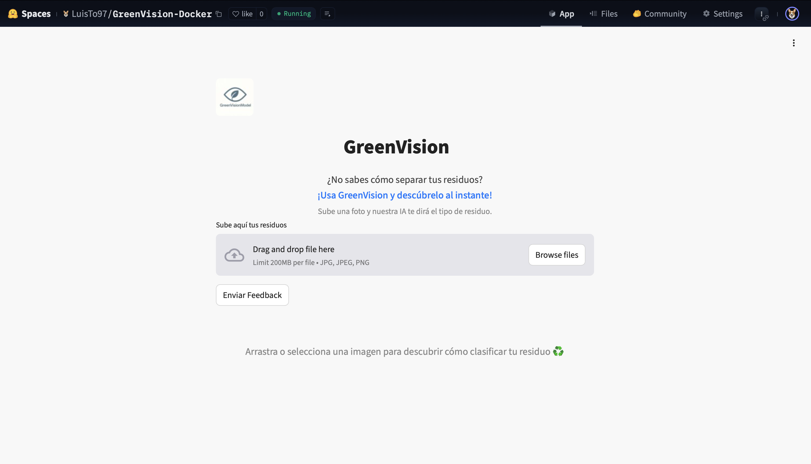
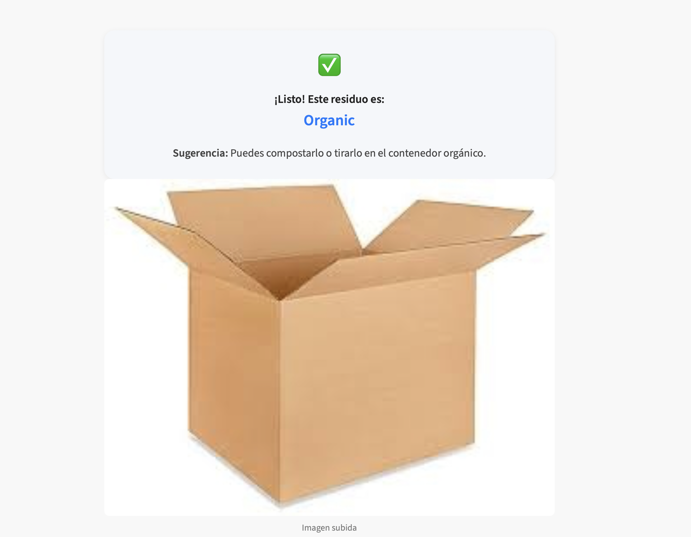

# GreenVisionModel

GreenVisionModel es un modelo de visión computacional y aprendizaje automático para la **clasificación automática de residuos**. Permite distinguir entre categorías como reciclable, no reciclable, orgánico, entre otras, facilitando procesos de reciclaje y gestión ambiental.

## Estructura principal

La aplicación principal es una **API** que expone el modelo para clasificación de imágenes de residuos.  
Todos los archivos necesarios para el despliegue y la instalación de dependencias se encuentran en la carpeta `api/`.

## Características principales

- Clasificación de residuos en categorías como reciclable, no reciclable, orgánico, etc.
- API lista para producción, compatible con despliegue en contenedores Docker.
- Procesamiento de imágenes usando aprendizaje automático y visión computacional.

## Requisitos

- Python 3.x
- Docker (opcional, recomendado para despliegue)
- Bibliotecas especificadas en `api/vision_requirements.txt`
- Git

## Instalación y despliegue

1. **Clona el repositorio:**
https://github.com/LuisT0/greenvision.git

2. **Instala las dependencias (si no usas Docker):**
pip install -r vision_requirements.txt

3. **(Opcional) Usa Docker para crear el contenedor de la API:**
docker build -t greenvision-api.

docker run -p 8000:8000 greenvision-api

4. **Inicia la API localmente (sin Docker):**
python main.py

## Uso

- Envía imágenes a la API a través de los endpoints documentados para obtener la categoría del residuo (reciclable, no reciclable, etc.).
- Los resultados se devuelven en formato JSON.

## Estructura del repositorio

| Carpeta/Archivo            | Descripción                                       |
|----------------------------|---------------------------------------------------|
| `api/main.py`              | Script principal de la API                        |
| `api/models/`              | Modelos entrenados y utilidades                   |
| `api/vision_requirements.txt` | Dependencias de la API                          |
| `api/Dockerfile`           | Configuración para contenedores Docker de la API  |
| `data/`                    | Imágenes de ejemplo para clasificación            |
| `output/`                  | Resultados generados (si aplica)                  |
| `README.md`                | Documentación del proyecto                        |

## Ejemplo de uso

A continuación se muestra una captura de la API funcionando:

## Contribuciones

¡Las contribuciones son bienvenidas! Por favor, abre un issue o haz un pull request para sugerir mejoras o cambios.

## Licencia

[MIT]
